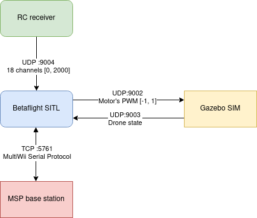

# Betaflight

The Gazebo support for Betaflight was added in this [PR](https://github.com/betaflight/betaflight/pull/12346).
It's already available in `master` branch.



## Packages available

 - **betaflight_configurator**:  This package download and install in the workspace the
 ground control station. To connect with the SITL please use "Manual" and "Port: tcp://127.0.0.1:5761"

    **IMPORTANT**: you need to modify the settings of the Betaflight SITL to enable arming and the motors. In order to do this you'll need to run the file `betaflight_SITL.elf` located in `~/vg/install/betaflight_sim/share/betaflight_sim/bin/betaflight_SITL.elf` and connect to it through the program `Betaflight Configurator`:

    1. Open `Betaflight Configurator`
    2. In the `Port` field on the top bar insert the address `tcp://127.0.0.1:5761` and click `Connect`
    3. In the side tabs you need to configure the following:
      - `Modes`: Configure arm in `AUX1` (range `1500` - `2100`)
      - `Motors`: Select `PWM` and enable `3D`
      Remember to click `Save` in order to commit the changes. You can shut down and reopen `betaflight_SITL.elf` to check that the settings have been saved in `Betaflight Configurator`.
    4. Once you have verified that the changes have been committed you will need to copy the configuration file `eeprom.bin` that has been generated from `~/vg/install/betaflight_sim/share/betaflight_sim/bin/eeprom.bin` to `~/vg/install/betaflight_sim/share/betaflight_sim/config/eeprom.bin`:

        ```bash
        cp ~/vg/install/betaflight_sim/share/betaflight_sim/bin/eeprom.bin ~/vg/install/betaflight_sim/share/betaflight_sim/config/eeprom.bin
        ```

 - **betaflight_controller**: When the drone is connected to SITL this requires an RC, otherwise
 the flight controller will generate a failsafe (RX_FAILSAFE). This program will open a
 UDP socket in the port 9004. Values are between [1000 - 2000]
   - Connect a joystick
   - You need to run `ros2 run joy joy_node`
   - And then `source ~/vg/install/setup.bash && ros2 run betaflight_controller betaflight_joy_controller`.

 - **betaflight_gazebo**: This plugin will send the state data to the SITL and it will received
 the data from the motors [-1, 1].
  - Sending state output to SITL at UDP link: 127.0.0.1:9002
  - Receiving PWM from SITL at UDP server: 127.0.0.1:9003

 - **betaflight_sim**: Download and install the betaflight flight controller.

## Run the simulation

```bash
ros2 launch betaflight_sim quadcopter.launch.py
```

## Test
